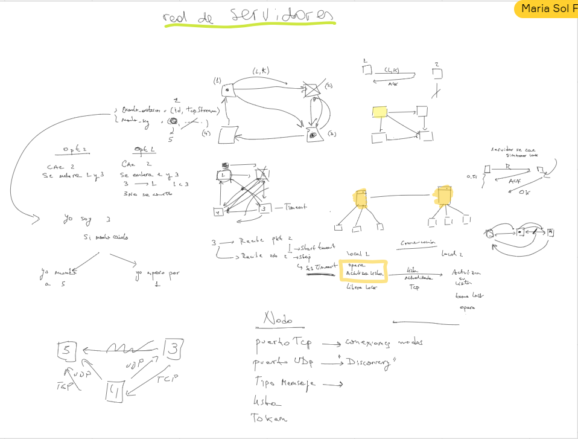
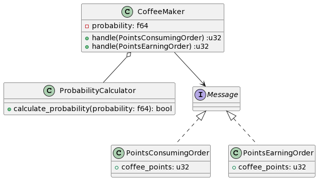

# Trabajo Práctico N° 2 - Coffeewards

- **Autores**: 
* [Alejo Villores](https://github.com/alejovillores)
* [Bautista Rodriguez](https://github.com/BautistaRodriguez)
* [Sol Fontenla](https://github.com/solfonte)

## Scripts

Correr coffee maker
`RUST_LOG=info cargo eun --bin coffee_maker` 

## Estructura de los locales

## Diagrama de clases Coffee Maker

