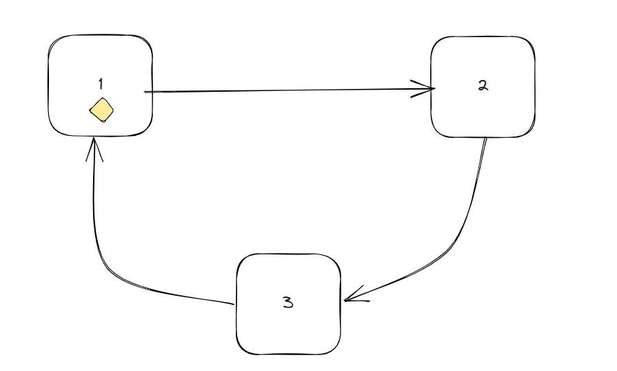

# Trabajo Práctico N° 2 - Coffeewards

**Autores**: 
* [Alejo Villores](https://github.com/alejovillores)
* [Bautista Rodriguez](https://github.com/BautistaRodriguez)
* [Sol Fontenla](https://github.com/solfonte)

## Indice

1. [Detalles de implementación](#detalles-de-implementación)
2. [Estructura de los locales](#estructura-de-los-locales)
3. [Desarrollo](#desarrollo)
4. [Conclusiones](#conclusiones)

## Detalles de implementacion  

### Servidores

La arquitectura implementada para los servidores utiliza un enfoque distribuido basado en el principio del "token ring". En este diseño, cada servidor se conecta al siguiente servidor en la secuencia utilizando un identificador único. Este enlace en forma de anillo permite que los tokens (un elemento especial de control) se pasen de manera secuencial y activa entre los servidores.

Esta arquitectura tiene varias ventajas. 
1. Garantiza que los tokens se transmitan en orden 
2. Manera predecible a través de los servidores conectados. Esto permite un procesamiento confiable y consistente de los tokens en la secuencia correcta.

Además, la arquitectura es capaz de adaptarse a situaciones de fallos en los servidores. Si un servidor se cae o deja de funcionar, la arquitectura tiene la capacidad de reorganizarse y continuar operando sin interrupciones significativas. Los tokens pueden ajustarse dinámicamente para omitir el servidor caído y continuar el paso secuencial en el anillo hacia los servidores restantes. Esto garantiza que la funcionalidad del sistema se mantenga incluso en caso de fallos puntuales.

### Cafeteras

Cada servidor está conectado a varias cafeteras a través de conexiones TCP y cada cafetera tiene asociado un actor asincrónico que se encarga de manejar los mensajes. Cada cafetera mantiene una lista de órdenes que debe ejecutar.

La comunicación entre la cafetera y el servidor se basa en un protocolo de mensajes que incluye dos tipos principales: REQ (solicitud) y RES (respuesta). En el caso de un mensaje REQ, se envía al servidor con información sobre la cuenta y los puntos de café, en el siguiente formato: ``REQ, <account_id>, <coffee_points>.`` Por otro lado, el mensaje RES se utiliza para la respuesta del servidor y se envía acompañado de una acción realizada, siguiendo este formato: ``RES, <operación>, <account_id>, <coffee_points>.``

La cafetera espera una confirmación específica en respuesta a cada tipo de mensaje. Para los mensajes REQ, espera recibir un mensaje de tipo ``OK``, indicando que la solicitud fue procesada correctamente. Para los mensajes RES, espera recibir un mensaje de tipo ``ACK``, que confirma que el servidor ha realizado la operación solicitada de manera exitosa.

Esta forma de comunicación permite que la cafetera esté al tanto del estado de las operaciones realizadas por el servidor y garantiza que se complete de manera satisfactoria.

### Resumen protocolo

| Mensaje | Coffee Maker | Local Server |
|---------|--------------|--------------|
| ``TOKEN``   | SI           | NO           |
| ``SYNC ``   | SI           | NO           |
| ``REQ  ``   | SI           | SI           |
| ``RES  ``   | SI           | SI           |
| ``ADD  ``   | SI           | SI           |
| ``SUBS ``   | SI           | SI           |
| ``UNBL ``   | SI           | SI           |

## Estructura de los locales  

#### Boceto de Reunion

#### Diagrama de clases Coffee Maker

## Desarrollo  

#### Scripts

Correr coffee maker
`RUST_LOG=info cargo run --bin coffee_maker <server_id>` 

Correr local server
`RUST_LOG=info cargo run --bin local-server <server_id>`

#### Local Server dependencies

| Crate              | Versión     |
|--------------------|-------------|
| actix              | **0.13.0**  |
| actix-rt           | **2.8.0**   |
| actix-testing      | **1.0.1**   |
| log                | **0.4.0**   |
| env_logger         | **0.10.0**  |
| mockall            | **0.11.4**  |
| mockall_double     | **0.3.0**   |
| tokio              | **1.17.0**  |

#### Coffee Maker dependencies
| Crate              | Versión     |
|--------------------|-------------|
| actix              | **0.13.0**  |
| actix-rt           | **2.8.0**   |
| log                | **0.4.0**   |
| env_logger         | **0.10.0**  |
| rand               | **0.8.5**   |
| mockall            | **0.11.4**  |
| mockall_double     | **0.3.0**   |
| serde_json         | **1.0.96**  |
| serde              | **1.0.163** |
| serde_derive       | **1.0.163** |

## Conclusion  

Como equipo, enfrentamos desafíos debido a nuestra falta de familiaridad con el lenguaje Rust y las distintas bibliotecas, lo que afectó nuestra velocidad y eficiencia en el desarrollo del trabajo. Los plazos ajustados nos llevaron a adoptar soluciones que podrían considerarse un poco complejas.
